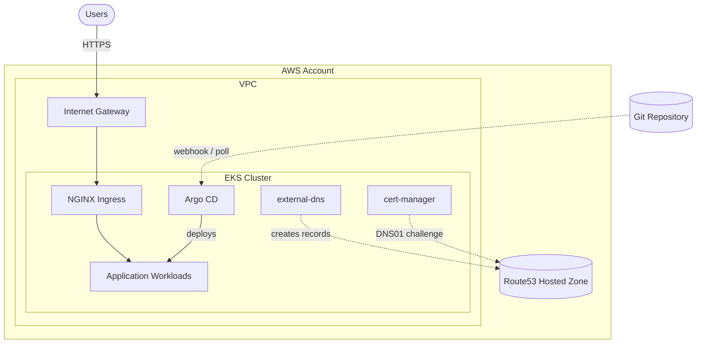

<div align="center">

# Advanced K8s Labs

### Production-grade Kubernetes platform on AWS EKS, provisioned with Terraform and operated via GitOps.


[Architecture](#-architecture) •
[Getting Started](#-getting-started) •
[Accessing Argo CD](#-accessing-argo-cd) •
[Troubleshooting](#-troubleshooting) •
[Roadmap](#-roadmap)

</div>

---

## 📖 Overview

This repository provisions a complete, opinionated Kubernetes platform on AWS. Infrastructure is defined in **Terraform**, in-cluster platform tooling is installed via **Helm**, and application workloads are continuously delivered through **Argo CD**. TLS certificates and DNS records are issued and reconciled automatically — push to Git, get a working HTTPS endpoint.

> [!NOTE]
> This is a learning / portfolio project intended to demonstrate production-style patterns. Review IAM scopes and resource sizing before using in a real environment.

---

## 🏗 Architecture

The platform is composed of two layers: an **infrastructure layer** managed by Terraform, and a **platform layer** installed on top of EKS via Helm.



<details>
<summary><b>Infrastructure Layer (Terraform)</b></summary>

- VPC with public and private subnets across multiple AZs
- Internet Gateway, NAT Gateway, and route tables
- EKS control plane and managed node groups (nodes in private subnets)
- IAM roles, including IRSA roles for in-cluster controllers
- Route53 hosted zone wiring

</details>

<details>
<summary><b>Platform Layer (Helm)</b></summary>

| Component | Responsibility |
| --- | --- |
| **NGINX Ingress Controller** | Cluster entry point; HTTP/HTTPS routing and TLS termination |
| **cert-manager** | Issues and renews Let's Encrypt certificates via DNS01 |
| **external-dns** | Reconciles Route53 records from Ingress resources |
| **Argo CD** | GitOps controller; syncs manifests from Git into the cluster |

</details>

---

## 🧰 Tech Stack

<table>
<tr>
<td valign="top">

**Cloud & Infra**
- AWS EKS
- VPC / IAM / Route53
- Terraform

</td>
<td valign="top">

**Platform**
- Helm
- NGINX Ingress
- cert-manager
- external-dns

</td>
<td valign="top">

**Delivery**
- Argo CD (GitOps)
- Let's Encrypt
- IRSA (OIDC)

</td>
</tr>
</table>

---

## 📁 Repository Layout

```text
advanced-k8-labs/
├── cert-man/
│   └── issuer.yaml              # ClusterIssuer for Let's Encrypt
├── helm-values/
│   ├── argocd.yaml              # Argo CD Helm values
│   ├── cert_manager.yaml        # cert-manager Helm values
│   └── external_dns.yaml        # external-dns Helm values
├── apps/
│   └── app-hub.yml              # Application manifests
├── argocd-apps/
│   └── apps-argo.yaml           # Argo CD Application definitions (App of Apps)
├── eks.tf                       # EKS cluster and node groups
├── helm.tf                      # Helm releases for platform tooling
├── irsa.tf                      # IAM Roles for Service Accounts
├── locals.tf                    # Shared Terraform locals
├── provider.tf                  # Terraform and AWS provider config
├── vpc.tf                       # VPC, subnets, NAT, IGW
└── README.md
```

---

## ✅ Prerequisites

Install the following locally:

```bash
# macOS (Homebrew)
brew install terraform awscli kubectl helm argocd
```

You also need:

- An AWS account with permissions to create VPC, EKS, IAM, and Route53 resources
- An AWS profile or credentials configured (`aws configure`)
- A Route53 hosted zone for the domain you plan to use

---

## 🚀 Getting Started

### 1. Clone the repository

```bash
git clone https://github.com/<your-org>/advanced-k8-labs.git
cd advanced-k8-labs
```

### 2. Provision infrastructure

```bash
terraform init
terraform plan
terraform apply
```

This creates the VPC, EKS cluster, IAM/IRSA roles, and installs the platform Helm charts.

### 3. Configure kubectl

```bash
aws eks update-kubeconfig --name <cluster-name> --region <region>
kubectl get nodes
```

### 4. Verify platform components

```bash
kubectl get pods -n ingress-nginx
kubectl get pods -n cert-manager
kubectl get pods -n external-dns
kubectl get pods -n argocd
```

All pods should reach `Running`.

---

## 🔐 Accessing Argo CD

Argo CD is exposed at:

```
https://argocd.lab.hassanhome.com
```

### Retrieve the initial admin password

A handy shell alias:

```bash
# ~/.zshrc
alias argopass='kubectl get secret argocd-initial-admin-secret -n argocd -o jsonpath="{.data.password}" | base64 --decode'
```

Then:

```bash
source ~/.zshrc
argopass
```

Log in with username `admin` and the password printed above.

### Rotating the admin password

<details>
<summary><b>Click to expand step-by-step instructions</b></summary>

Generate a bcrypt hash and patch the `argocd-secret`:

```bash
HASH=$(argocd account bcrypt --password 'YourNewPassword')

kubectl -n argocd patch secret argocd-secret \
  --type=merge \
  -p "{\"stringData\":{\"admin.password\":\"$HASH\",\"admin.passwordMtime\":\"$(date +%FT%T%Z)\"}}"

kubectl rollout restart deployment argocd-server -n argocd
kubectl rollout status deployment argocd-server -n argocd
```

> [!WARNING]
> Always single-quote bcrypt hashes when assigning to shell variables — they contain `$` characters that would otherwise be expanded by the shell, leaving a corrupted hash in the secret.

Verify the patch landed correctly:

```bash
kubectl -n argocd get secret argocd-secret \
  -o jsonpath="{.data.admin\.password}" | base64 --decode; echo
```

You should see a string starting with `$2a$` or `$2b$`.

</details>

---

## 📦 Deploying Applications

Applications are deployed declaratively through Argo CD using the **App of Apps** pattern.

### 1. Bootstrap the root application

```bash
kubectl apply -f argocd-apps/apps-argo.yaml
```

Argo CD will then discover and sync every child application defined in the repository.

### 2. Example application manifest

```yaml
apiVersion: apps/v1
kind: Deployment
metadata:
  name: the-app-hub
spec:
  replicas: 1
  # ...
```

Once committed and synced, the application is reachable over HTTPS at its configured domain — DNS and TLS are handled automatically.

---

## ⚙️ How It Works

**Platform bootstrap**

```text
terraform apply
   └─► VPC, EKS, IAM/IRSA
         └─► Helm releases
               ├─► NGINX Ingress Controller
               ├─► cert-manager
               ├─► external-dns
               └─► Argo CD
```

**Application delivery**

```text
git push
   └─► Argo CD detects change
         └─► Manifests applied to cluster
               ├─► Ingress created
               │     ├─► external-dns → Route53 record
               │     └─► cert-manager → Let's Encrypt cert (DNS01)
               └─► NGINX serves HTTPS traffic
```

---

## 🛡 Security

- **IRSA** — pods assume scoped IAM roles via OIDC federation; no static AWS credentials in the cluster
- **Private node groups** — worker nodes live in private subnets; only the ingress load balancer is publicly reachable
- **Automated TLS** — every Ingress gets a valid Let's Encrypt certificate with automatic renewal
- **Least privilege** — IAM policies for cert-manager and external-dns are scoped to the specific Route53 hosted zone

---

## 🔧 Troubleshooting

<details>
<summary><b>Argo CD login keeps failing after a password reset</b></summary>

Verify the secret actually contains a bcrypt hash, not a placeholder:

```bash
kubectl -n argocd get secret argocd-secret \
  -o jsonpath="{.data.admin\.password}" | base64 --decode; echo
```

You should see a string starting with `$2a$` or `$2b$`. If it doesn't, re-run the patch with the hash in single quotes (see [Rotating the admin password](#rotating-the-admin-password)).

</details>

<details>
<summary><b>Certificates stuck in <code>Issuing</code> state</b></summary>

Inspect the Certificate and CertificateRequest events:

```bash
kubectl describe certificate <name> -n <namespace>
kubectl describe certificaterequest -n <namespace>
```

Most issues are DNS propagation or IRSA permission related.

</details>

<details>
<summary><b>DNS record not appearing in Route53</b></summary>

Check the external-dns logs:

```bash
kubectl logs -n external-dns deployment/external-dns
```

Confirm the Ingress has the correct host annotation and that the IRSA role has `route53:ChangeResourceRecordSets` on the hosted zone.

</details>

---

## 🗺 Roadmap

- [ ] Argo CD ApplicationSets for multi-tenant deployments
- [ ] Observability stack (Prometheus, Grafana, Loki)
- [ ] CI pipelines with GitHub Actions
- [ ] Multi-environment overlays (dev / staging / prod)
- [ ] Horizontal Pod Autoscaling and Cluster Autoscaler
- [ ] AWS Load Balancer Controller
- [ ] Progressive delivery with Argo Rollouts (blue/green and canary)

---

## 🎓 Learning Outcomes

This project demonstrates hands-on experience with:

- Designing and provisioning production EKS clusters with Terraform
- Building a GitOps delivery pipeline with Argo CD
- Automating DNS and TLS in a cloud-native environment
- Implementing pod-level AWS identity with IRSA
- Operating Kubernetes ingress, certificate, and DNS controllers
- Structuring infrastructure and application code for reproducibility

---

## 📄 License

Released under the [MIT License](LICENSE).

<div align="center">

⭐ If you found this useful, consider starring the repo.

</div>
